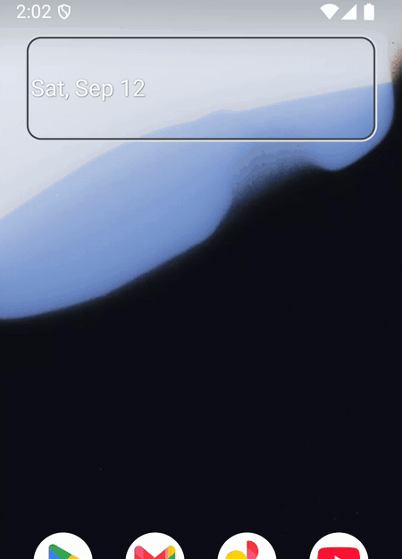

# ⚡ Quick Launch

**Type a few letters. Press Enter. The app opens.**

A Spotlight-style app launcher for Android. Keyboard-first, instant, and out of your way.

[**Download the APK**](https://github.com/AhmedTheGeek/QuickLaunch/releases/latest) · [How it works](docs/TECHNICAL.md) · GPL-3.0

---

## Why

Finding an app on Android means scrolling a grid or opening a search that still makes you tap the
result. Quick Launch treats your phone like a computer: summon it, type two or three letters, press
Enter. Done. Touch is optional.

It is not a home screen replacement. It is a small card that appears over whatever you are doing and
disappears the moment you launch something.

## What you get

- **Instant.** Appears on the very next frame after you trigger it. No animation, no spinner.
- **Smart matching.** Exact and prefix matches first, then word starts, then initials.
  `mbs` finds Meta Business Suite, `yt` finds YouTube.
- **Learns from you.** Apps you launch often rise to the top. Grant *Usage access* and your most used
  apps are already listed before you type.
- **Pin your essentials.** Tap the pin on the highlighted row (or press Ctrl+D) and that app sits in
  a Pinned section at the top, in a fixed order, every time. Ctrl+1 to Ctrl+9 launch a row directly.
- **Keyboard first.** Ctrl+Space opens it from any app. ↑ ↓ to move, Enter to launch, Esc to close.
  Tab, Ctrl+N and Ctrl+P work too.
- **Split screen by drag.** Long-press a result and drag it to open it next to the current app.
- **Long-press for more.** Hold a result for App info or Add to Home screen.
- **Copied a link?** It shows up as the first row. Press Enter to open it.
- **Quick math.** Type `3x3` or `(12+4)/2` and the answer is the first row. Enter copies it.
  Units too: `10cm in inch`, `70f to c`, `5 kg in lb`.
- **Type a link, open it.** `github.com/AhmedTheGeek` or `example.org` opens in its app or the browser.
- **Search keywords.** `g pizza near me` searches Google, `yt funny cat` YouTube. Also `ddg`,
  `wiki`, `maps`, `play` and `gh`. Opens in the matching app when you have it.
- **Phone settings and the flashlight.** `wifi`, `bluetooth`, `battery` open that page; `torch`
  toggles the flashlight. Give them aliases too, like `fl`.
- **Your own shortcuts.** Give an app an alias in settings (`sp` for Spotify) and typing it always
  puts that app first.
- **Settings when you want them.** Type `settings` (or `qls`) to open Quick Launch Settings: turn
  features off, change keywords, add your own search engines.
- **Big screens welcome.** A centered palette on tablets, foldables and DeX. Full width on phones.
- **Private by design.** No internet permission. No analytics. No ads. About 90 KB.

## Install

1. Download the APK from the [latest release](https://github.com/AhmedTheGeek/QuickLaunch/releases/latest)
   and open it on your phone. Allow installing from your browser when asked.
2. Open Quick Launch once and tap the **⚡ row** to allow *Display over other apps*. That is what makes
   it instant.
3. Optional: tap the **⌨ row** to enable Ctrl+Space, and the **★ row** to show your most used apps.

Android 8.0 or newer. The blur behind the card needs Android 12 or newer.

## How to trigger it

| You have | Do this |
|---|---|
| A physical keyboard | Enable the **⌨ Ctrl+Space** shortcut from the card. |
| A Samsung phone | Good Lock → **One Hand Operation+** → any gesture → *Open app* → Quick Launch. Or Settings → Advanced features → Side button → double press → Quick Launch. |
| Android 16 with a keyboard | Settings → Physical keyboard → Keyboard shortcuts → assign Meta + a key to Quick Launch. |
| Anything else | Tap the Quick Launch icon like any app, or put it in your dock. |

> **Ctrl+Space greyed out with "Restricted setting"?** Android 13+ asks you to allow it once for
> apps installed outside a store: Settings → Apps → Quick Launch → ⋮ → *Allow restricted settings*.

## Good to know

- Opening Quick Launch over a playing video app sends that app into picture-in-picture, the same as
  any launcher-style app does. The Ctrl+Space shortcut avoids it.
- Over Settings and some secure screens Android hides overlays, so the card appears with the normal
  app animation there instead of instantly.
- No internet permission, no analytics, nothing leaves the device.
  [Privacy policy](https://ahmedthegeek.github.io/QuickLaunch/privacy-policy.html).

## For the curious

Architecture, the measurements behind "instant", and how to build it:
**[docs/TECHNICAL.md](docs/TECHNICAL.md)**.

## License

GPL-3.0. See [LICENSE](LICENSE).
